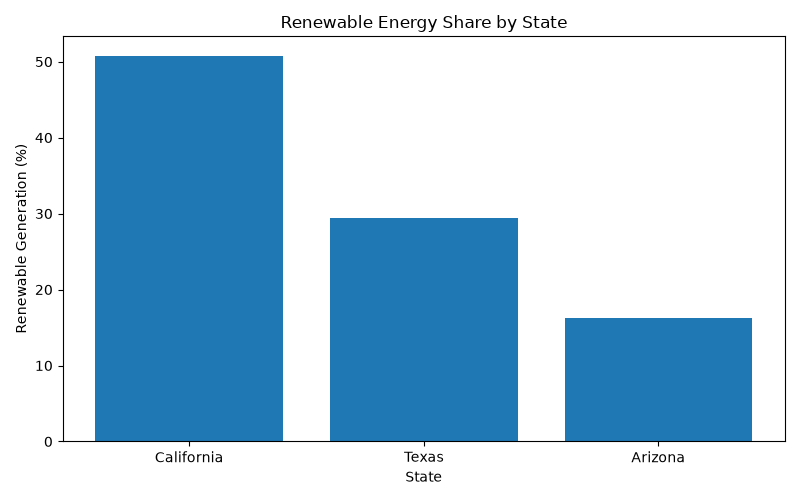
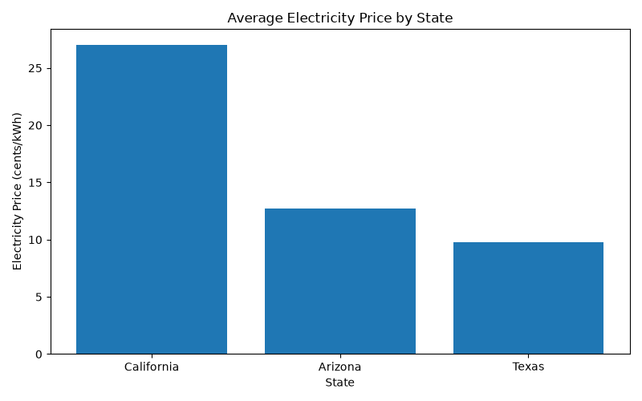

# U.S. Energy Market Analysis

## Overview

This project analyzes selected U.S. electricity market indicators using Python and pandas.

The analysis focuses on renewable energy generation and average electricity prices across selected states. The goal is to identify differences in renewable energy participation and electricity pricing through a simple, data-driven market analysis.

## Objectives

- Calculate the share of renewable electricity generation by state.
- Compare average electricity prices across states.
- Identify differences between selected U.S. energy markets.
- Create visualizations to communicate key findings.
- Generate automated insights from the underlying data.

## Tools & Technologies

- Python
- pandas
- matplotlib
- CSV data
- GitHub Codespaces

## Analysis

The analysis calculates renewable energy share using total net electricity generation and renewable electricity generation.

It also compares average electricity prices, measured in cents per kilowatt-hour (¢/kWh).

### Renewable Energy Share

The analysis identifies the states with the highest and lowest renewable energy shares within the dataset.



### Average Electricity Price

The project also compares average electricity prices across the selected states.



## Key Findings

Based on the current dataset:

- California has the highest renewable energy share among the selected states.
- Arizona has the lowest renewable energy share among the selected states.
- California has the highest average electricity price among the selected states.
- Texas has the lowest average electricity price among the selected states.

These findings are descriptive and reflect only the states and data included in this project.

## Project Structure

```text
energy-market-analysis/
│
├── data/
│   └── energy_market_data.csv
│
├── analysis/
│   └── market_analysis.py
│
├── renewable_energy_share.png
├── average_electricity_price.png
└── README.md